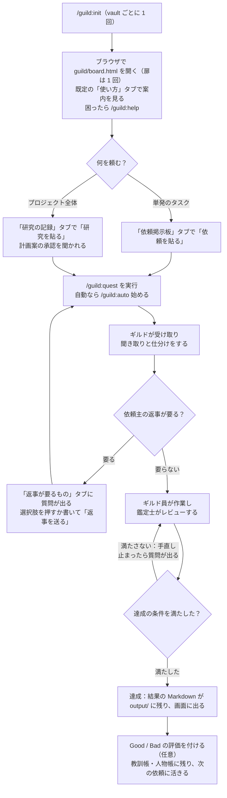

# guild：冒険者ギルド

Obsidian vault のタスクを、冒険者ギルドのギルド員たち（Claude Code のサブエージェント）で片付けるプラグインです。tmux は使わず、1 つの Claude Code セッションの中で動きます。Windows・Mac・Linux（cron）のどれでも、どの Obsidian の vault でも使えます（vault ごとに `/guild:init` でギルドを開きます）。Obsidian の vault は推奨で、必須ではありません。普通のフォルダでも動きますが、`[[ノート名]]` のリンクをたどれず、グラフビューも使えません。

## 入れ方

marketplace に追加してから install する、2 段階です。marketplace に追加しただけでは、プラグインは読み込まれません。

### 前提
- Python 3 が要ります（`py`・`python3`・`python` のどれかを自動で探します）。Windows では Git Bash も要ります。
- Word・Excel・PowerPoint を読み書きする外部ライブラリは、vault の外の venv（`~/.guild/venv`、Windows は `%USERPROFILE%\.guild\venv`）に `/guild:init` が入れます。Python が無い・入れられないときは Office の変換だけが使えず、ノートと回答だけのクエストは動きます。

### 手順
1. marketplace に追加する。Claude Code で、次のどちらかを実行します。
   - GitHub から入れる（git が使える場合）:
     ```
     /plugin marketplace add asama0101/guild
     ```
   - zip を手動で置く: GitHub のリポジトリ画面で「Code」→「Download ZIP」を押し、展開したフォルダを置いてから実行します。
     - 置き場所の推奨は、Windows が `C:\Users\<ユーザー>\Documents\guild-plugin`、Mac・Linux が `~/Documents/guild-plugin` です。
     - vault の中には置かないでください。また、追加したあとにフォルダを動かすと読み込めなくなります（そのときは「やり直す」へ）。
     ```
     /plugin marketplace add C:\Users\<ユーザー>\Documents\guild-plugin
     ```
2. install する。scope は 1 つだけ選び、両方は実行しません。
   - その vault だけで使う（推奨）: その vault のルートで実行します。`.claude/settings.json` に記録され、そのプロジェクトだけで有効になります。自分だけで使う場合は `--scope local` にします。
     ```
     claude plugin install guild@guild --scope project
     ```
   - どの場所でも使う:
     ```
     /plugin install guild@guild
     ```
3. 読み込む。出力に「1 plugin」と表示され、skills・agents の数が増えていれば読み込めています。
   ```
   /reload-plugins
   ```
4. 使いたい vault のルート（`.obsidian/` があるフォルダ。Obsidian を使わないなら普通のフォルダでもよく、そのときは `/guild:init` が 1 回確認します）で Claude Code を開き、次を 1 回実行します。
   ```
   /guild:init
   ```
   あとは画面（`guild/board.html`）で依頼を貼り、次を実行します。別の vault でも使うときは、その vault で `/guild:init` をもう 1 回実行します。
   ```
   /guild:quest
   ```

### 注意
- vault の置き場所は問いません（OneDrive・iCloud・Git・ローカル）。同期フォルダにあるときは、`/guild:quest` の実行中に別の PC で同じ vault の `guild/` を書き換えないでください（同期で上書きされます）。
- 冒険者は Web を検索して調べます。Claude Code に WebSearch・WebFetch の使用を聞かれたら許可してください（`/permissions` で許可の一覧に足すと、毎回は聞かれません）。

### 更新する
新しい版を反映します。zip で入れた場合は、先に新しい zip を同じ場所へ上書きしてください。
```
/plugin marketplace update guild
```

### やり直す
```
/plugin marketplace remove guild
```
そのあと、手順 1 からやり直します。

## ギルドの役

| 役 | 中身 |
|---|---|
| ギルドマスター | メインのセッション。`/guild:quest` で就任。割り振りと状態の判定と記録だけをする |
| 受付嬢 `receptionist` | 依頼主の窓口。依頼の聞き取り、ギルド員の質問の取り次ぎ、結果の要約と締めの報告の文面 |
| 賢者 `sage` | 質問と返事で分かった事実と決まりを、知識帳（`guild/40_knowledge/`）に話題ごとに書き写す |
| 書記 `scribe` | 単発も研究も、すべてのクエストの仕分け（担当・急ぎ度・前提クエスト・触るノート・達成の条件） |
| 冒険者 `adventurer` | Web と vault 内の調べもの |
| 吟遊詩人 `bard` | ノートの作成・追記 |
| 鍛冶師 `smith` | Word・Excel・PowerPoint・PDF・テキストなどのファイルを作る（会社の型に合わせる） |
| 司書 `librarian` | リンク切れ・迷子のノート・タグや用語の揺れの見回り、用語の候補の拾い出し |
| 鑑定士 `appraiser` | 成果物のレビュー（クエストの達成の条件で合否を決める） |
| 錬金術師 `alchemist` | 研究（目標）を研究ノートにまとめ、何をどの順でやるかのクエストに分ける |
| 占い師 `seer` | 結果の評価（Good / Bad）の聞き取りと、依頼主へのインタビュー。人物帳と教訓の案を書く |

## コマンド
- `/guild:init`：vault に `guild/` と HTML の画面（`board.html` の 1 枚。`research.html` は `board.html#research` へ飛ばすだけ）を用意する。最初に 1 回だけ。
- `/guild:quest`：画面に貼られた依頼と、質問への返事を受け取り、クエストをギルド員に割り振って片付ける。
- `/guild:auto`：`/guild:quest` を決まった間隔で自動で動かす（`始める`・`止める`・`様子`）。`様子` は今日と 7 日の使用量も伝える。
- `/guild:help`：動かし方と止め方を案内し、いまの状態（自動実行・錠・冒険中の件数・返事待ち・使用量）を読んで、いま何をすればよいかを伝える。読むだけで、何も書き換えない。

### 使い方の流れ



## 画面（HTML）`guild/board.html`
画面は `guild/board.html` の 1 枚です。Edge か Chrome で開き、「ギルドの扉を開く」で `guild` フォルダを選びます（扉は 1 回だけ。タブを切り替えても出ません。更新しても、許可済みなら自動でつながります）。サーバーやインストールは要りません。帯の 4 つのタブ（使い方・返事が要るもの・依頼掲示板・研究の記録）は画面の中で切り替わり、開いたときの既定は「使い方」です。`guild/research.html` は `board.html#research` へ飛ばすだけの古いブックマーク用のファイルです。答えると次の回でギルドが動きます（Ctrl+Enter でも送れます）。PC のブラウザ向けです。

### 使い方タブ
- 動かし方・止め方・状態の見方・用語の説明、自動実行の状態（動いているか・間隔・最後の回）、使用量（今日 / 7 日 / 累計）、設定（同時数）が見られます。
- **同時数：** 冒険中にできる件数を 1〜8 で変えられます（既定 4）。変更は依頼として置かれ、次の回に取り込まれます（範囲外は受け付けません）。
- **使用量：** 自動実行の回ごとの使用量（`guild/.system/logs/usage.jsonl`）の集計です。手で実行した `/guild:quest` の回は数えません。プランの残量は Claude Code の `/usage` で見ます。

### 返事が要るものタブ
- クエスト・研究・やること・承認を問わず、返事待ちを 1 か所に並べます。カードの見出しに、クエスト（または研究）の番号と題がバッジで出ます。帯のタブの赤丸が未返事の件数です。
- **絞り込み：** 「クエスト・研究」で絞れます（研究を選ぶと、そのクエストの質問も含みます）。依頼掲示板・研究の記録のタブの返事欄にも同じ絞り込みがあります。
- **返事済み：** 返事を送ったカードは同じ位置に残り、緑の枠と「✓ 返事済み（受け取り待ち）」の帯で目立ちます（薄くなって末尾に寄ります。送り直しもできます。赤丸には数えません）。更新しても同じ見た目で、ギルドマスターが受け取ると消えます。
- **まとめて送る：** 質問カードのチェックを入れて一括で送ります。送れたもののチェックは外れ、未入力で送れなかったものはチェックが残って「未入力」と赤字で出ます。
- 10 秒ごとの読み直しは、内容が変わったときだけ描き直し、入力欄にフォーカスがあるあいだ（日本語の変換中も）は待つので、入力は途切れません。

### 依頼掲示板タブ（タスクの管理）
- **依頼を貼る：** 内容・急ぎ度・期限・成果物の形（おまかせ・回答だけ・ノート・テキスト・Word・Excel・PowerPoint・PDF・その他）・くわしくを書き、資料があれば「資料を添える」で選んで「依頼を貼る」。
- **Inbox のメモ：** vault に `Inbox/` があれば（`/guild:init` が見つけて設定します）、そこのメモも依頼として受け付けます。メモは動かしません。
- **質問に返事：** クエストの質問と「依頼主がやること」が出ます（「返事が要るもの」タブにも同じものが出ます）。選択肢があるときは選択肢を押し（「（コメントへ）」の付いた選択肢はひとことも書きます）、無いときは自由に書いて「返事を送る」。
- **取り消す：** 達成・中止でないクエストのカードの「取り消す」で、そのクエストを取り下げられます（研究の記録では研究ごと）。次の回で中止になり、作業中でも結果は作りません。まだ受け取られていない依頼（受付待ち）は、札の「取り下げる」でその場で消せます。
- **状況と結果：** クエストごとに状態、担当、属する研究、結果の要約、成果ノート（`[[ノート名]]` で表示。押すとコピーして Obsidian に貼れる）、質問と返事、冒険の記録が見られます。
- **状態の一覧：** 受付済（仕分けが済んで出発を待つ）・冒険中（ギルド員が作業中）・鑑定中（鑑定士が見ている）・要手直し（鑑定で直しが出た）・返事待ち（依頼主の返事を待つ）・依頼主がやること・達成・中止。画面に出る「受付待ち」は、貼ったばかりでギルドマスターがまだ受け取っていない依頼を示す画面だけの仮の状態で、`board.json` には無い。

### 研究の記録タブ（プロジェクト全体の状況）
- **先頭：** 「研究（一覧）」「研究を貼る」「ギルドからの知らせ」が横並びで並びます（幅が足りないときは折り返します）。その下に「承認と返事」、選んだ研究と段の地図が続きます。
- **研究を貼る：** 目標・期限・くわしくを書き、資料があれば添えて「研究を貼る」（研究に急ぎ度はありません。代わりに優先度が付き、貼った直後は `通常` です）。錬金術師が研究ノート（`guild/10_projects/<研究名>/<研究名>.md`）を作ってクエストに分け、書記が各クエストの担当と達成の条件を付けます（その前に、受付嬢が目標の分からないところを聞き取ります）。
- **計画の承認：** 分け方を見て「この案で進める」か「直してほしい（コメントへ）」を返事します。承認の前に計画を変えたいときは「直してほしい（コメントへ）」に変えたいことを書きます（錬金術師が直して、もう一度承認を聞きます）。研究についての質問もここに出ます。
- **研究一覧：** 研究ごとに状態、優先度、目標、期限、研究ノート、進み具合、クエストの一覧（担当・状態・結果）、次の段階、研究の経過が見られます。優先度（優先・通常・保留）は、研究として受け付けられたあと（計画中・承認待ち・進行中）から、達成か中止になるまで、一覧のボタンで切り替えられます。変更を送ったあとは、取り込まれるまでボタンは待ちになります。貼った直後でまだ受け付けられていない研究には、ボタンは出ません。
- **優先度：** 冒険中の枠（同時数。既定 4 件で、使い方タブで 1〜8 に変えられます）は、研究の優先度、クエストの急ぎ度（★）、期限、番号の順に埋めます。優先度はクエストの急ぎ度とは別物です。`保留` の研究のクエストは新しく出発させません（冒険中・鑑定中のものは鑑定まで進めます）。

### 用語集 `<vault>/guild/30_glossary/`（専門用語。1 語 1 ノート）
- クエストが達成すると、司書が成果から用語の候補を拾い、吟遊詩人が用語ノート（意味・使い方・関連・出典）を書きます。
- 依頼掲示板の「用語を足す」からも登録できます。意味を空にすると冒険者が調べます。
- ギルド員は作業の前に用語集を見て、同じ言い方で書きます。
- 依頼に用語集に無い言葉があると、受付嬢が見つけます。社内の言葉や略語は依頼掲示板で意味を聞き（返事が来るまでそのクエストは止まります）、一般の専門用語は担当のギルド員が作業の前に調べます。どちらも回の終わりに用語ノートになります。

### 用語のつながり
- 用語ノートの「関連」には種類（上位・下位・対・関連）を付け、相手のノートにも逆向きを書きます。Obsidian のグラフビューで用語どうしのつながりが見えます。
- 冒険者は、依頼に出てくる語の用語ノートから、リンクを 2 段までたどって調べます。どこからたどったかを報告書に書き、3 つ以上の話をつないだ結論は「推測」と書きます。

### クエストの進み方
- クエストの状態の移り方は決まった表のとおりで、ギルドマスターはその場で決めません（表は `commands/quest.md`）。`保留` の扱いは遷移表の下の注に、出発させる順は board.json の形の節にあります。
- どのクエストにも「達成の条件」があり、鑑定士はそれで合否を決めます。手直しは、指摘が毎回変わって前に進んでいるあいだは続けます。止めるのは、同じ指摘がまた出たとき（直したものが元に戻る行ったり来たりも含む）、直すたびに満たさない条件が増えたとき、手直しが 5 回になったときで、依頼掲示板で質問します。研究の計画を書記が錬金術師に差し戻すときも同じです。
- 依頼掲示板の冒険の記録には、どう移ったか（例「鑑定中→要手直し」）と理由が残ります。研究の記録では、クエストを段（前提の深さ）ごとに並べます。

### 聞き取り（grilling）
- 依頼の分からないところは、作業の前に受付嬢が聞き取ります（研究の目標も）。vault や資料で分かることは自分で調べ、依頼主にしか分からないことだけを、推奨の答えと理由をつけて依頼掲示板で聞きます。作業中のギルド員の質問も受付嬢が取り次ぎ、調べれば分かるものは依頼主に聞かずに答えます。
- 答えで次に決めることが出てくれば、次の回に続けて聞きます。聞くことが無くなったら「この理解で進めてよいですか」と確認してから出発します（研究は計画の承認が確認を兼ねます）。

### 振り返り（同じ失敗をくり返さない）
- 鑑定で手直しになった失敗や、依頼主の「直して」は、教訓帳 `guild/lessons.md` に残ります。ギルド員は作業の前に自分の教訓を読みます。研究の計画を作る受付嬢・錬金術師・書記にも、決まり・教訓帳・知識帳が渡ります。
- 研究が達成・中止で締まるときも、計画と実際の差などを研究単位の教訓として教訓帳に残します（型は「分割の粒度」「前提の置き方」）。
- 同じギルド員が同じ型の失敗を 2 回すると、鑑定士が決まりの案を書き、依頼掲示板で「この決まりを足しますか」と聞きます。足した決まりは `guild/.system/rules/<ギルド員>.md` に入り、次から依頼書に付きます。
- 決まりを足したあとも同じ失敗が出たら、プラグイン本体の直し案を `guild/.system/skill-review.md` に書いて知らせます。

### 評価と人物帳（依頼主を知って精度を上げる）
- 達成したクエストと研究に Good / Bad とひとことを付けられます。占い師が、どこが・なぜ・次はどうするかを、推奨の答えつきの質問で聞き取ります（grilling）。確認で認めると、教訓帳（Good も Bad も）・決まり・人物帳に残ります。Bad でやり直すと決めれば、ギルド員がやり直します。
- 人物帳 `guild/client.md` には、依頼主の仕事と立場・読み手と使い道・好みの形・言葉づかい・判断の基準・避けたいことが、出典つきで貯まります。どの依頼書にも付き、ギルド員は依頼主に合わせて作ります。
- 依頼の聞き取りのたびに、人物帳に無くてその依頼に要ることを 1〜2 問だけ聞きます。依頼掲示板の「インタビューを受ける」からは、占い師に人物帳だけを深掘りしてもらえます（1 回 3〜5 問、続けるか終えるかを選べます）。

### フォルダ（vault の構成）
```
vault/
├ .obsidian/、Inbox/                 そのまま（vault 直下）
└ guild/
   ├ board.html、research.html       画面（board.html を開く。research.html は飛ばすだけ）
   ├ client.md、lessons.md           人物帳、教訓帳
   ├ guild_templates/                会社の型（稟議の PowerPoint など）
   ├ 10_projects/<研究名>/           研究ノート、input/（資料）、output/（成果物と結果の Markdown）
   ├ 20_quests/<番号> <内容>/        単発のクエストのノート、input/、output/（成果物と結果の Markdown）
   ├ 30_glossary/                    用語ノート
   ├ 40_knowledge/                   知識帳（質問と返事で分かった事実と決まり。目次は 知識帳.md）
   └ .system/                        ギルドの内部ファイル（隠しフォルダ）
      ├ board.json、auto.json
      ├ quests/、reports/、rules/、work/、logs/（logs/usage.jsonl は自動実行の使用量）
      ├ requests/、answers/、feedback/
      └ auto/                        自動実行のスクリプトと設定
```
- `guild/.system/` は隠しフォルダなので Obsidian の一覧には出ない。Obsidian Sync などで同期されるかは設定による。
- 添えた資料は受付のときに `input/` に入ります。Word・Excel・PowerPoint は、ギルドマスターが venv の `markitdown` で Markdown の写しを作り、ギルド員は写しを読みます。
- 達成したクエストは、成果物の形が「回答だけ」「おまかせ」でも、結果の全文を Markdown（`<番号> 結果.md` など）として `10_projects/<研究名>/output/` か `20_quests/<番号> <内容>/output/` に必ず残し、クエストのノートからリンクします（隠しフォルダの `.system` には置きません）。すでに達成していた分は、次の `/guild:quest` で結果の要約から補います（1 回に 10 件まで。全文は残っていないので、要約だけです）。
- vault に同じ役のフォルダがあれば、`/guild:init` がそれを使います。

計画を変えたいときは、承認の前なら承認の「直してほしい（コメントへ）」、承認のあと（進行中）なら研究の記録の「計画を直す」で、終わっていないクエストの変更・取りやめ・追加を頼めます。達成・中止したものと、作業中（冒険中・鑑定中）のものは変えません。直した計画は「計画の直し：この進め方でよいですか」でもう一度承認してから動き出し、直しているあいだはその研究の新しいクエストは出発しません（作業中のものは鑑定まで進めます）。

画面は 10 秒ごとに読み直します。依頼掲示板のタブでは、依頼を貼る欄（常に開いています）と知らせの下に、クエストが 4 列のかんばん（受付／冒険中／返事待ち・依頼主がやること／達成）で並びます。カードの「くわしく」で達成の条件や結果の全文が見られます。研究の記録のタブでは、一覧で研究を選ぶと「段の地図」（段ごとの列にクエストの札。左の段が終わると右に進む）が出ます。

貼った依頼と返事は、次に `/guild:quest` を実行したとき（自動実行なら次の回）にギルドマスターが受け取ります。

### ギルドからの知らせ
- 回の終わりに受付嬢が書いた報告（何が片付いたか、何を待っているか）が、依頼掲示板のタブの上に新しい順で 20 件まで出ます。研究の記録のタブの先頭には最新の 1 件が出ます。Claude Code の画面を見なくても、結果が分かります。
- 止まっている要因（許可待ち・返事待ち・保留など。1 行に 1 つ）は、知らせの中に赤字で別行に出ます。自動実行の最後の回が失敗したときの帯も同じ赤字です。何も止まっていなければ出ません。

### 自動実行 `/guild:auto`

```
/guild:auto 始める
/guild:auto 止める
```

- `/guild:auto 始める` で、決まった間隔（推奨 5 分。間隔と許す道具の足し引きは 1 回にまとめて聞かれます）に `/guild:quest auto` が動きます。Python（標準ライブラリだけの `guild-run.py`）が、Windows はタスク スケジューラ、Mac と Linux は cron に登録します。
- 新しい依頼・返事・評価（`requests/`・`answers/`・`feedback/` の直下のファイル）が無い回は Claude を呼ばずに終わるので、費用はかかりません。Inbox のメモだけでは自動の回は動きません（次に依頼・返事・評価が貼られた回で一緒に受け付けます。急ぐなら手で `/guild:quest` を実行します）。
- 許す道具は `guild/.system/auto/allow.txt`（1 行に 1 つ）。一覧に無い操作は断られ、そのクエストは返事待ちになって、画面の質問と知らせに「何の許可が要るか」が出ます。
- 動くのは、パソコンが起きていてログインしているあいだだけです。ログは `guild/.system/logs/`、画面の「使い方」タブに間隔と最後の回が出ます。Claude を呼んだ回の使用量（入力・出力のトークンと概算コスト）は `guild/.system/logs/usage.jsonl` に 1 行ずつ残り、画面に今日 / 7 日 / 累計が出ます（取れなかった値は「不明」。手で実行した回は数えません）。
- 自動の回が動いているあいだ（錠 `guild/.system/auto/run.lock` が 1 時間以内）に手で `/guild:quest` を実行すると、終わるまで待つよう言われます（同時に 2 つ動かないようにするため）。錠が 1 時間より古ければ、止まった回の残りなので消してかまいません。
- 止めるときは `/guild:auto 止める`。
- `guild/.system/` 配下の `claude.txt`・`path.txt`・`allow.txt`・`board.json` は自動実行時にそのまま使われるので、vault に書き込める人は、自動実行のユーザー権限でコマンドを実行できるのと同じになります。信頼できない人と vault を共有しないでください。

しくみ：画面は `board.json`（ギルドマスターだけが書く）を表示し、依頼主の書き込み（研究の優先度や同時数の変更も `requests/` に置かれます）は `requests/` と `answers/` と `feedback/` に 1 件 1 ファイルで置きます。書き手が分かれているので、ぶつかりません。読み終えたファイルは `済/` に、まだ受け付けられないもの（計画を直している研究へのもう 1 つの直し、聞き取り中の重ねた評価など）は `保留/` に移り、受け付けられるようになった回で読まれます。

## 開発者向け

中身を直したら、`plugin.json` と `marketplace.json` の両方の version を上げてから、利用者に「更新する」を案内します。
